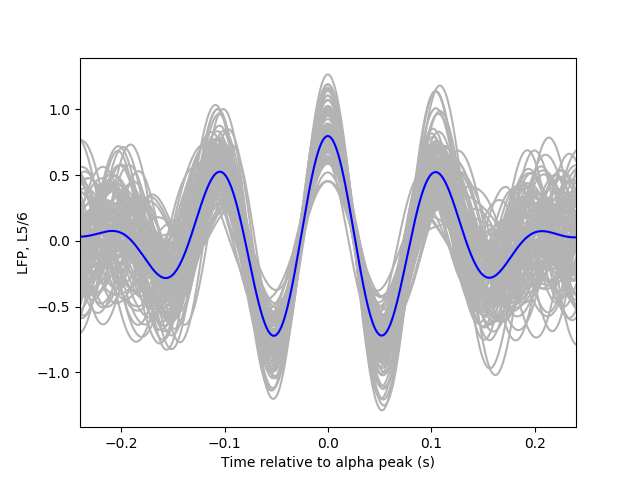

Overview of the main results of the simulation in Python. The methods used to analyse
the simulation will be adapted to also analyse the results of the NeuroML2 simulation.

## Intralaminar
This model considers the simulation of excitatory and inhibitory neurons of supra- and infragranular layers. Note that the excitatory and inhibitory populations of both layers are not connected. The parameters of the model were adjusted so that the layer 2/3 oscillates within the gamma (~40 Hz) and layer 5/6 falls within the alpha/low-beta range (~10-30 Hz).

As in the original paper, we tested the effect on the gamma frequency on layer 2/3 of increasing the stimulus on the simulation. Higher input values lead to stronger gamma rhythms in the excitatory firing rate power spectrum.
Note that, to obtain this power spectrum the authors subtracted the case with no input to the case with different inputs.
The plot below can be generated by running:
```
python Mejias-2016.py -analysis intralaminar
```


## Interlaminar
Here we consider connections between the L2/3 and L5/6 layer. As described in the original paper, when the interlaminar coupling is present (green and orange lines below) the oscillatory dynamics spread across the layers. This is clearly visible in the plot below, where the power spectrum of Layer 2/3 shows a strong alpha component only when both layers are coupled.

```
python Mejias-2016.py -analysis interlaminar_a
```
<p float="left">
  
  
</p>

To further analyse the dynamic interaction between the two layers the authors analysed the LFP (Local Field Potential) from the layer 5/6 with respect to the alpha rhythm from Layer 2/3. The analysis can by calling:

```
python Mejias-2016.py -analysis interlaminar_b
```


## To improve:
* The speed of the simulation, in particular, the interlaminar simulation is very slow at the moment
* Calculate the spectrogram of the interlaminar signal
