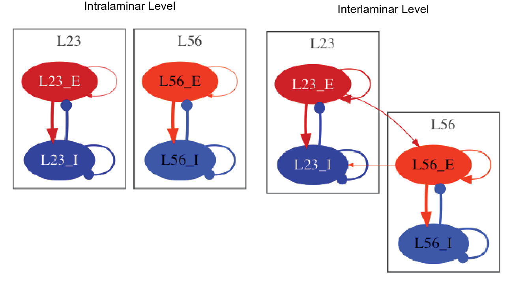

# Mejias-2016
Implementation in Python and of NeuroML2/LEMS and Mejias, Jorge F.,
John D. Murray, Henry Kennedy, and Xiao-Jing Wang. 2016a.
“Feedforward and Feedback Frequency-Dependent Interactions in a Large-Scale
Laminar Network of the Primate Cortex.” https://doi.org/10.1101/065854.

## The model
The model simulates the dynamics of a cortical laminar structure across multiple
scales: (I) intralaminar, (II)
interlaminar, (III) interareal, (IV) whole cortex. Interestingly, the authors show
that while feedforward pathways are associated with gamma oscillations (30 - 70 Hz),
feedback pathways are modulated by alpha/low beta oscillations (8 - 15 Hz).

## The Simulation

### Python
So far, we have reproduced the main findings described by Mejias et al., 2016 at the [intralaminar](Python/intralaminar.py) and [interlaminar](Python/interlaminar) level. The main results are described [here](Python/README.md).

### NeuroML2
A basic implementation and simulation of the intralaminar model have also been implemented in NeuroML2/LEMS. [GenerateNetwork.py](NeuroML2/GenerateNetwork.py) generates the LEMS file with the description of the network.

To run the simulation inside the NeuroML2 folder run:
`python GenerateNetwork.py -jnml`

## Requirements
The necessary Python packages are listed on the `requirements.txt` files.
